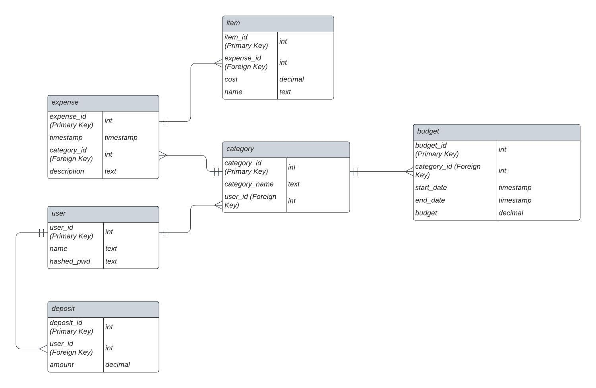

# expense_db
Expense database for CSC-365

Description:
This project will be a backend api for an expense tracker. It should allow users to manage 
their expenses and track their progress. Some of the data tracked will include transaction
data such as price, time/date, item, and category. Other data could include user information
such as spending limits, income, goals, etc. With all this data, a relational database 
seems justified as it will allow us to manage many different scopes of data. 

contributers: jogara@calpoly.edu zlnavarr@calpoly.edu rnair02@calpoly.edu

## User Stories:

- As a customer, I want to be able to add an expense to the database, so that I can access it later
- As a customer, I want to be able to get a past expense and associated data, so that I can read detailed information for each expense
- As a customer, I want to be able to get all the expenses over a given date range or category, so that I can track my spending habits on a macro level
- As a customer, I want to be able to set a budget over a week, so that I can set spending goals
- As a customer, I want to be able to compare my spending to my budget, so that I can track my progress towards my goals

## Endpoints:

### Get expense
`GET: /user/{user_id}/expense/{expense_id}`

This endpoint returns the information associated with an expense by its identifier. For each expense it returns:

- `cost`: the monetary value of the expense, in Dollars
- `date`: the date of the expense
- `expense_id`: the ID of the item associated with the expense
- `category`: the user defined category of the item
- `description`: the user defined description of the item

### Get expenses over time
`GET: /user/{user_id}/expenses/`

This endpoint returns the information associated with expenses over a defined time period. By default, the difference between `start_time` and `end_time` is one week and `end_time` is today. For each expense, it returns:

- `cost`: the monetary value of the expense, in dollars
- `date`: the date of the expense
- `expense_id`: the ID of the item associated with the expense
- `category`: the user-defined category of the item
- `budget_delta`: a number showing the difference between current money spent in the category and the budget in place

### Get Budget
`GET: /user/{user_id}/budget/{category_id}`

This endpoint returns the user's budget information. By default, it will return all the user's budget information for all categories.

- `category`: the user-defined name of a specific category
- `budget`: the budget associated with the category
- `expenses`: the expenses associated with each category
- `budget_delta`: a number showing the difference between current money spent in the category and the budget in place

Each expense is represented by a dictionary with the following keys:

- `cost`: the monetary value of the expense, in dollars
- `item`: the item associated with the expense
- `date`: the date of the expense

### Set Budget
`POST: /user/{user_id}/budget/{category}/`

This endpoint adds or updates a category with a budget. It takes as input:

- `user`: the associated user for the budget
- `category`: the user generated category to be created/updated
- `budget`: the dollar amount of the budget

### Add Expense
`POST: /user/{user_id}/expense/`

This endpoint adds a new expense to the database. This expense includes some required data and some optional data:

- `user`: the user who is adding the expense (required)
- `cost`: the monetary value of the expense, in Dollars (required)
- `date`: the date of the expense (required)
- `category`: the user defined category of the item (not required)
- `description`: the user defined description of the item (not required)

## Edge Cases and Transaction Flow:

- Users should be required to include minimum data
  - If users don’t include required fields in an API called an error message should be returned
- Users should not be able to view or edit another user's information straight from an API call
  - If this is attempted an error message should be returned
- If a user attempts to create a category that already exists, it should instead update the existing category, rather than create duplicates

## ER Diagram
